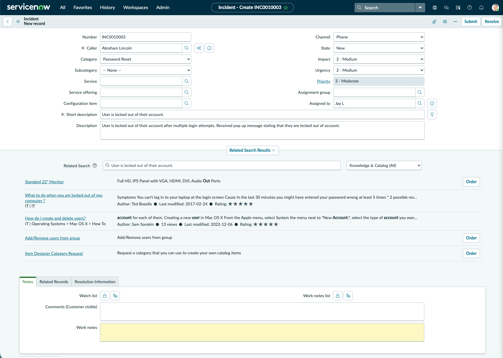
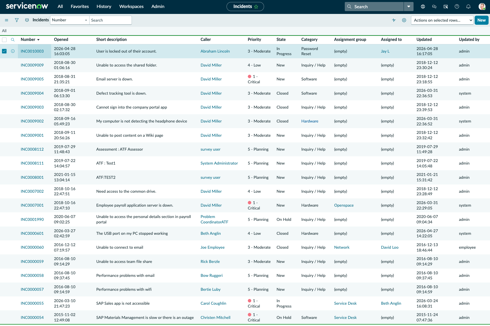
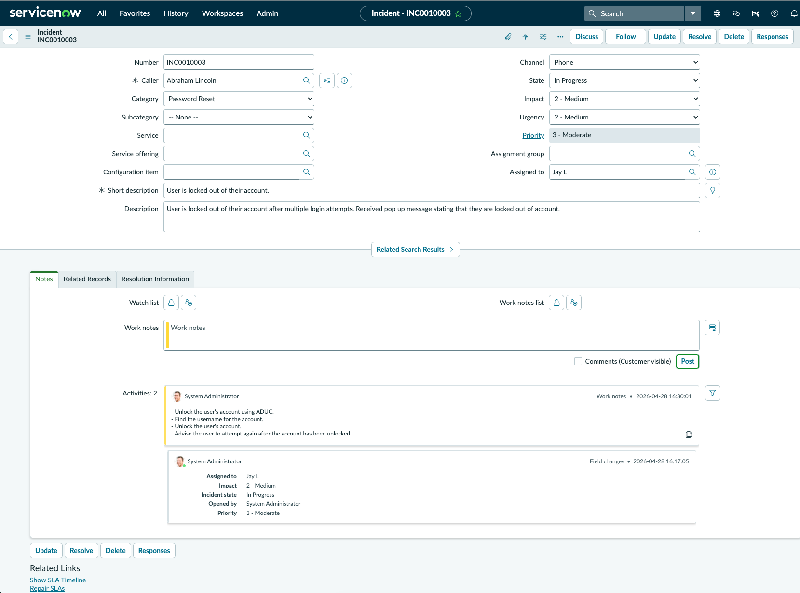
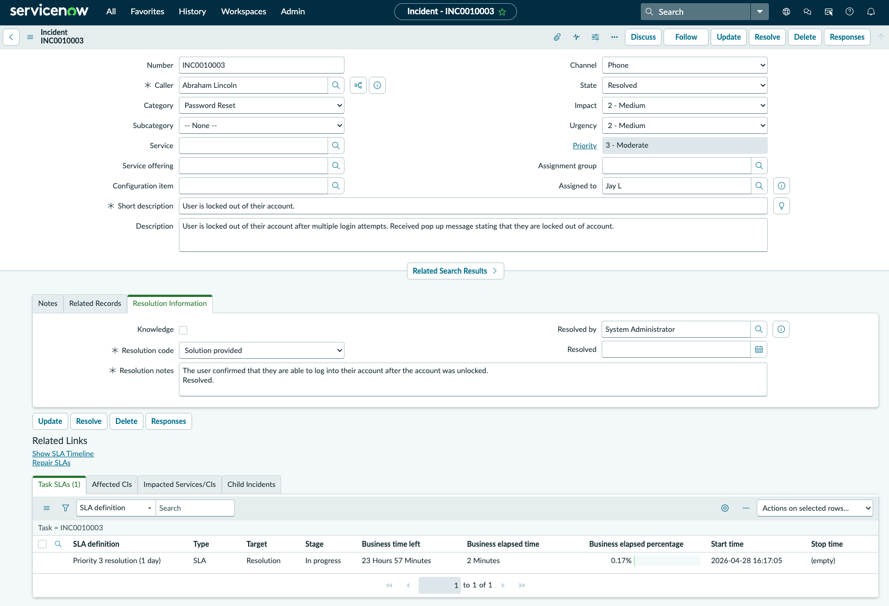
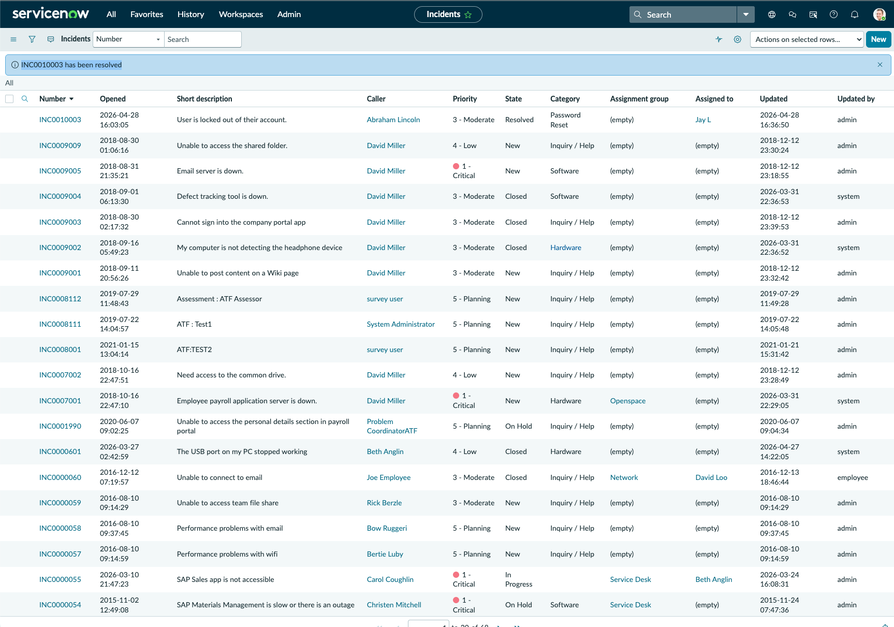

# ServiceNow Password Reset Incident Lab

## Objective
This lab demonstrates the process of creating, updating, documenting, and resolving a password reset incident in ServiceNow.

## Scenario
A user reported being locked out of their account after multiple failed login attempts. The incident was created, assigned, worked, documented, and resolved using ServiceNow.

## Tools Used
- ServiceNow Developer Instance
- Incident Management
- Work Notes
- Resolution Information
- SLA Tracking

## Steps Completed
1. Created a new incident for a user account lockout.
2. Set the category to Password Reset.
3. Assigned the ticket to a technician.
4. Updated the incident state to In Progress.
5. Added internal work notes documenting the troubleshooting steps.
6. Resolved the incident after the account was unlocked.
7. Added resolution notes and confirmed the ticket was successfully resolved.

## Ticket Details
- Incident Number: INC0010003
- Caller: Abraham Lincoln
- Category: Password Reset
- Priority: 3 - Moderate
- State: Resolved
- Assigned To: Jay L

## Work Notes
- Unlock the user's account using ADUC.
- Find the username for the account.
- Unlock the user's account.
- Advise the user to attempt again after the account has been unlocked.

## Resolution Notes
The user confirmed that they were able to log into their account after the account was unlocked. The incident was resolved.

## Skills Demonstrated
- ServiceNow ticket creation
- Incident documentation
- Password reset workflow
- Ticket assignment and state management
- Work notes and resolution notes
- SLA awareness
- Help desk / IT support workflow

## Screenshots

### 01 - Ticket Created

### 02 - Ticket State

### 03 - Incident Details

### 04 - Work Notes
.png)

### 05 - Resolution Notes

### 06 - Incident Resolved

This project shows hands-on experience using ServiceNow to manage a realistic password reset incident from creation through resolution. This workflow aligns with entry-level IT support, help desk, IAM, and GRC-adjacent roles.
